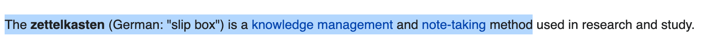

# wiki2roam

Chrome extension which copies text from Wikipedia with a [Roam](https://roamresearch.com/) style

1. Go to any Wikipedia page and select some text

2. Copy it using wiki2roam by pressing `Alt-C` on windows or `Option-C` on mac

3. Paste it into Roam

## Installation

1. Download and unzip this repo:  

1. In Chrome, go to settings > More Tools > Extensions
1. Click "Load unpacked"
1. Select the `wiki2roam_extension` folder within the downloaded repo
1. (Optional) Change the shortcut at "chrome://extensions/shortcuts" in Chrome
1. Done!
